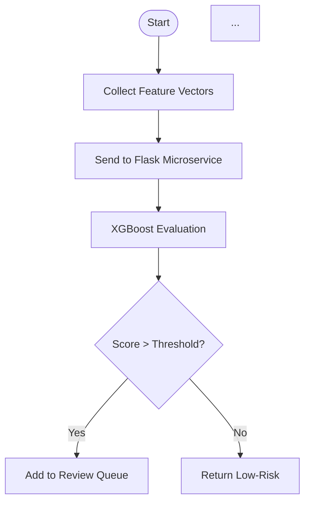

# Flowchart Generation Prompts - KarigarConnect

## Style & Theme Guidelines (All Flowcharts)

**Visual Style Reference:** Academic, black-and-white, professional UX research documentation style (see: Registration and Face Verification Activity diagram)

**Color Palette:**
- Background: White (#FFFFFF)
- Text & Lines: Black (#000000)
- Boxes/Nodes: White with black borders (2px)
- Decisions: Diamond shape, white fill, black border
- Processes: Rectangle, white fill, black border
- Start/End: Oval/Circle, black fill, white text

**Typography & Layout:**
- Font: Arial / Helvetica (sans-serif, clean)
- Font Size: 11–12pt for labels, 10pt for edges
- Line Style: Solid black, 1–1.5px stroke
- Padding/Margins: Balanced spacing; no crowding
- Flow Direction: Top-to-bottom primary; right-branching for conditional paths

**Academic Standards:**
- Clear node labels (active voice, concise: "Validate Form Data" not "Validating")
- Decision diamonds labeled with yes/no outcomes
- All paths explicitly labeled (→ Yes, → No)
- No ambiguous loops; retry counts shown in decisions
- Footnotes/legends if needed for non-obvious abbreviations

---

## **Prompt 5.7: Fraud Detection and Action Flow**

### **Full End-to-End Flowchart Generation Prompt**

```
Generate an academic-style black-and-white flowchart for "Fraud Detection and 
Administrative Action Workflow" following this specification:

TITLE:
"Figure 5.7: Fraud Detection and Action Flow"

ENTRY POINT:
Start node → "User Registration/Transaction Submitted"

PROCESS FLOW (Sequential):
1. Box: "Collect Feature Vectors"
   Details: Extract from registration data, transaction history, 
   behavioral patterns, and geolocation consistency logs

2. Arrow Down → "Send to Flask Fraud Microservice"

3. Box: "XGBoost Classifier Evaluation"
   Details: Assign fraud probability score to user

4. Decision Diamond: "Score > Configured Threshold?"
   - YES → Continue to step 5
   - NO → Go to "Return Low-Risk Assessment" → End

5. Box: "Add to Admin Fraud Review Queue"

6. Box: "Admin Reviews Case via Fraud Dashboard"
   Details: Display SHAP feature importance explanations

7. Decision Diamond: "Select Enforcement Action"
   - Branch 1 (Freeze): "Account Freezing" → Box: "Mark account frozen in DB"
   - Branch 2 (Flag): "Transaction Flagging" → Box: "Flag transaction record"
   - Branch 3 (Escalate): "Manual Review Escalation" → Box: "Route to manual team"
   - Branch 4 (Dismiss): "Dismiss as False Positive" → Continue to step 8

8. Box: "Remove from Review Queue" (for dismissed cases)

9. All branches converge → "Log Action in Audit Trail"

10. Final node → End

STYLING RULES:
- Use oval/circle shapes for Start/End nodes (filled black, white text)
- Use rectangles for processes (white fill, black 2px border)
- Use diamonds for decisions (white fill, black 2px border)
- Label all edges with Yes/No or action descriptions
- Maintain consistent horizontal/vertical alignment
- Leave adequate whitespace between elements
- No diagonal lines (only horizontal/vertical)
- Include a subtitle: "(Receives structured feature vectors, classifies risk, 
  queues high-risk cases for review, implements admin-selected enforcement)"

EXPORT:
- Format: SVG or PNG (300 DPI for print, black & white, no color)
- Size: A4 portrait (fits within ~7" × 9.5" when printed)
- File naming: "Figure_5.7_Fraud_Detection_Flow.svg"
```

---

## **Prompt 5.8: Rating and Completion Flow**

### **Full End-to-End Flowchart Generation Prompt**

```
Generate an academic-style black-and-white flowchart for "Job Completion and 
Two-Way Rating Workflow" following this specification:

TITLE:
"Figure 5.8: Rating and Completion Flow"

ENTRY POINT:
Start node → "Job Marked as Complete"

PROCESS FLOW (Sequential with Parallel Branches):

1. Box: "Trigger Rating Collection"
   Details: Both client and worker notified

2. Decision Diamond: "Client Submits Rating?"
   - YES → Continue to 3
   - NO → Wait/Timeout → Go to "Create default rating record" → step 5
   - (Show timeout path if applicable)

3. Box: "Client Provides Rating"
   Details: Star rating (1–5), reputation points, optional review comment

4. Arrow Down → "Store Client Rating in Rating Collection"

5. Parallel Process Box (dashed border or note): 
   "Worker Submits Rating" 
   Details: Star rating (1–5), reliability feedback, payment behavior notes

6. Arrow Down → "Store Worker Rating in Rating Collection"

7. Box: "Recalculate Worker Aggregate Metrics"
   Details: Average rating, total reputation points

8. Box: "Update Worker Record"
   Details: Store new metrics in Worker collection

9. Box: "Capture Pricing Metadata"
   Details: Store worker-quoted price + client-confirmed final paid price

10. Decision Diamond: "Both Ratings Complete?"
    - YES → Continue to 11
    - NO → Retry/Prompt logic → Retry count < 3? → If NO: default ratings

11. Box: "Mark Job as Completed with Full Metadata"

12. Box: "Store Rating Data for Model Training"
    Details: Snapshot in training dataset; pricingMeta used for semantic 
    matching model fine-tuning

13. Box: "Send Completion & Rating Notifications"
    Details: Push notifications to both parties; update dashboards

14. Final node → End

STYLING RULES:
- Use oval/circle shapes for Start/End nodes (filled black, white text)
- Use rectangles for processes (white fill, black 2px border)
- Use diamonds for decisions (white fill, black 2px border)
- Use dashed rectangle (or lighter border) for parallel/concurrent processes
- Label all edges with Yes/No or action descriptions
- Show retry paths with loopback arrows (labeled "Retry" or "Timeout")
- Maintain consistent alignment; parallel branches shown side-by-side at step 5–6
- Include a subtitle: "(Job completion triggers two-way rating; both ratings 
  aggregated into worker metrics; pricing metadata captured for model training)"

EXPORT:
- Format: SVG or PNG (300 DPI for print, black & white, no color)
- Size: A4 portrait (fits within ~7" × 9.5" when printed)
- File naming: "Figure_5.8_Rating_Completion_Flow.svg"
```

---

## **Tools & Generation Options**

### **Option 1: Mermaid.js (Recommended for Integration)**
**Syntax:** Mermaid diagram language (embeddable in Markdown, VS Code support)



### **Option 2: Lucidchart / Draw.io (Web-Based, Professional)**
- Import the above text prompts directly
- Drag-and-drop interface for refinement
- One-click export to SVG/PNG
- Collaboration features for team review

### **Option 3: GraphViz (Programmatic)**
```dot
digraph FraudDetection {
    rankdir=TB;
    node [shape=box, style="filled", fillcolor="white", color="black", penwidth=2];
    Start [shape=oval, label="Start"];
    ...
}
```

---

## **Academic Formatting Checklist**

- [ ] All nodes have clear, concise labels (active voice)
- [ ] Decision paths labeled "Yes/No" or action descriptions
- [ ] No ambiguous loops; retry counts explicit
- [ ] Whitespace balanced; no overlapping elements
- [ ] Black & white only; no color gradients
- [ ] Professional sans-serif font (Arial/Helvetica)
- [ ] Figure caption matches specification
- [ ] Export resolution ≥ 300 DPI for print
- [ ] File naming: `Figure_X.Y_[Description].svg`
- [ ] All external services/databases referenced in boxes
- [ ] Error/edge cases handled (timeouts, retries, dismissals)

---

## **Integration into PROJECT_DOCUMENTATION.md**

After generating flowcharts, insert as follows:

```markdown
### 5.7 Fraud Detection and Action Flow

[ Insert Figure 5.7 SVG/PNG here ]

**Figure 5.7:** Fraud Detection and Administrative Action Workflow  
*(Microservice receives structured feature vectors, XGBoost classifier assigns 
risk score, high-risk cases queued for admin review; SHAP explanations guide 
enforcement decisions: freeze, flag, escalate, or dismiss.)*

**Workflow Narrative:**  
[Paste existing text from your documentation]
```

Similarly for **Section 5.8 Rating and Completion Flow**.

---

## **References & Style Examples**

- **Your Uploaded Reference:** Registration and Face Verification Activity (UX flowchart style)
- **Academic Standards:** IEEE Std 1175-1994 (Flowchart symbols), ISO 5807 (flow diagram symbols)
- **Recommended Reading:** "Designing Better APIs" (Arnaud Lauret, Ch. 3: Flow Diagrams)

